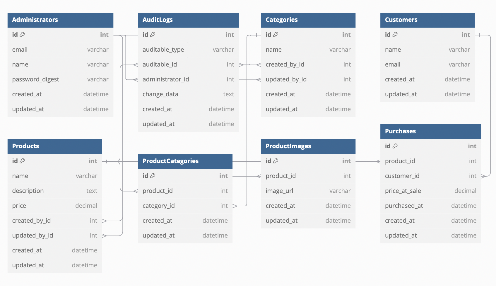

# PUNTOSPOINT Backend Project

## Project Overview

Welcome to the PUNTOSPOINT backend project, an e-commerce platform built with Ruby on Rails 3 and Ruby 1.9.3. This application provides robust APIs for managing products, categories, purchases, and audit logging while supporting detailed analytics and reporting.

The project was developed to fulfill the following objectives:

1.	Core Requirements:

- [x] CRUD operations for Products, Categories, Customers, and Purchases.
- [x] Associating Products with multiple Categories and adding Product Images.
- [x] Audit logging for tracking Administrator actions (creation, updates, deletions).
- [x] Sending emails for first product purchases and daily sales reports.
- [x] JWT-based authentication for Administrators to access APIs securely.

2.	Technical Requirements:
- [x] Fully optimized PostgreSQL database with associations.
- [x] Redis caching for high-performance API responses.
- [x] Sidekiq for background jobs (daily sales reporting and email notifications).
- [x] JSON APIs documented with Swagger.

3.	Additional Features:
	•	API response caching using Redis.
	•	Comprehensive RSpec tests for API endpoints.
	•	Modular and scalable code adhering to Rails best practices.
	•	Entity-Relationship Diagram (ERD) for database structure.

## Tech Stack

- Language: Ruby 1.9.3
- Framework: Rails 3
- Database: PostgreSQL
- Caching: Redis
- Background Jobs: Sidekiq
- Testing: RSpec
- Containerization: Docker and Docker Compose

## Setup Instructions

Pre-requisites

1.	Install Docker & Docker Compose


  •	[Install Docker](https://docs.docker.com/engine/install/)
  •	[Install Docker Compose](https://docs.docker.com/compose/install/)

2.	Environment Variables
The project relies on environment variables defined in a `.env` file. Ensure you create this file at the root of the project with the following content:

```bash
DATABASE_HOST=db
DATABASE_USER=appuser
DATABASE_PASSWORD=password
DATABASE_NAME=appdb
REDIS_URL=redis://redis:6379/0
SMTP_ADDRESS=smtp.gmail.com
SMTP_PORT=587
SMTP_DOMAIN=gmail.com
SMTP_USER_NAME=operacionesvm45@gmail.com
SMTP_PASSWORD=dbrmzzrvfbmowmby
SMTP_AUTHENTICATION=plain
SMTP_ENABLE_STARTTLS_AUTO=true
JWT_SECRET=Llave&D1f1c1l_^D3_1div1n4r$
```


Steps to Run the Server / Services (Redis + Sidekiq + PostgreSQL)

1.	Clone the Repository

```bash
git clone <repository_url>
cd <repository_directory>
```

2.	Build and Start the Services

```bash
docker-compose build
docker-compose up
```

3.	[OPTIONAL] Run Database Migrations (just in case, migration are not applied automatically after the previous commands)
Inside the running container, run:

```bash
docker-compose exec app rake db:create db:migrate
```

4.	Access the Application

The API server will be running at http://localhost:3000.

5. Run the seeds

```bash
docker-compose exec app rake db:seed
```

5. Run the Rspec test

```bash
docker-compose exec app rspec
```
## API Endpoints

### Authentication

- [x] Login (JWT Token Generation):

```bash
POST /api/sessions
```
Request Body:

```bash
{
  "email": "admin@example.com",
  "password": "password"
}
```

Response:
```bash
{
  "token": "your_jwt_token_sha256"
}
```


### Products Endpoints

Consider check the [POSTMAN file](https://github.com/DanteAlonsoHT/old-rails-docker/blob/main/Test%20Técnico%20PuntosPoint.postman_collection.json) to see the exported version of API calls for the 5 endpoints.


- [x] Most Purchased Products by Category:

```
GET /api/products/most_purchased_by_category
```

Response: List of top products per category.

- [x] Top Earning Products by Category:

```
GET /api/products/top_earning_by_category
```

Response: List of top 3 earning products per category.

### Purchases Endpoints

	•	List Purchases:
	•	GET /api/purchases
	•	Filters:
	•	from (date)
	•	to (date)
	•	category_id (single or multiple)
	•	customer_id (single or multiple)
	•	admin_id (single or multiple)
	•	Purchase Count by Granularity:
	•	GET /api/purchases/count_by_granularity
	•	Parameters:
	•	granularity (hour, day, week, year)

### Notification Workers - Jobs

Sales Report:
- [x] Sends a daily report of purchases to administrators using Sidekiq with Excel file attached.

First Purchase Email:
- [x] Sends an email to administrators when a product is purchased for the first time.

### Database Structure



### Core Features:

- [x] Fully functional CRUD for Products, Categories, Purchases, and Customers from console.
- [x] JWT-based authentication for secure access.
- [x] Sidekiq for background jobs (email and reports).
- [x] Redis for caching high-demand endpoints.

###  Extras Added:

- [x] Caching: Implemented with Redis for API optimization.
- [x] Audit Logs: Tracks all actions (create, update, delete) performed by Administrators.
- [x] API Documentation: Created with SwaggerDoc Gem.
- [x] Test Coverage: Comprehensive RSpec tests.
